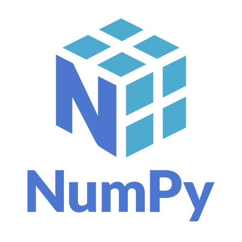

<!--
**Kai-Striega/Kai-Striega** is a ✨ _special_ ✨ repository because its `README.md` (this file) appears on your GitHub profile.

Here are some ideas to get you started:

- 🔭 I’m currently working on ...
- 🌱 I’m currently learning ...
- 👯 I’m looking to collaborate on ...
- 🤔 I’m looking for help with ...
- 💬 Ask me about ...
- 📫 How to reach me: ...
- 😄 Pronouns: ...
- ⚡ Fun fact: ...
-->

# Hi I'm Kai 👋

I'm a maintainer of SciPy and software developer at BHP who is passionate about free and open source software, scientific computing, and building diverse communities within technology.

## 🔭 I’m currently working on ...

SciPy  and NumPy 
